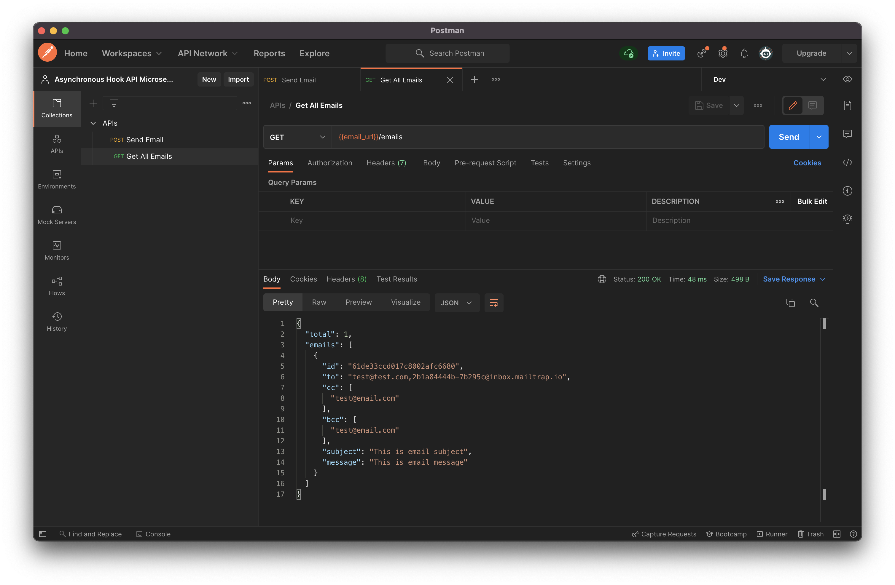

# Asynchronous Hook API Microservice

This project shows how different services can be communicated asynchronously in the microservice architecture.

## Tech stack

- docker - for containerization different services
- node - for handling server asynchronously
- mongo - for NoSQL database
- typeorm - for database abstraction
- express - for API development together with `express validator` for request validattion
- rabbitmq - for service resiliency in communicating different services
- nodemailer - for mailing service
- jest - for unit testing

Development is done with `typescript` programming language.

## How to start

In order to run the application, you will need `docker` installed on your machine.

First, rename `.env.example` to `.env` or create `.env` file in the root directory with the following values. It is used for securely storing environment variables for different services. Please set those values before running services.

```
MONGO_INITDB_ROOT_USERNAME=
MONGO_INITDB_ROOT_PASSWORD=
MONGO_DATABASE=

MAIL_HOST=
MAIL_PORT=
MAIL_USER=
MAIL_PASS=
MAIL_FROM=
```

In the root directory of the project run `docker compose up`. All the necessary services will be automatically downloaded and configured. This step could take a while.

Once all services are up. Async Hook API can be tested. In the project's `postman` directory, there are two files included.

- [APIs.postman_collection.json](./postman/APIs.postman_collection.json)
- [Dev.postman_environment.json](./postman/Dev.postman_environment.json)

Import both files into postman. From collection, select `Send Email` request and click on `Send`. You will see response came back with `200` status code and empty `body`.


You can confirm the email is successfully saved by running `Get All Emails` request from the postman.



The message is produced by the `app` service and consumed by the `email` service. `email` service is responsible for saving the incoming message into the database and sending via email using `nodemailer`.

For resiliency, events are transferred via `rabbitmq`. Even services like `email` went down, all the events will be queue and once the service is up and running, those event messages will be confidently handled. You can test this by stopping the `email` service while all the other services are running.

Once the docker is running, rabbitmq service can be checked by going to the browser and open the url `localhost:15672`. For easy access, rabbitmq is configured with default credentials which are username - `guest` and password - `guest`.


You will be directed to RabbitMQ Dashboard


## Testing

In order to run tests, you will need to access the containers running `email` and `app`. This can be done by running following commands.

### App Service

1. Make sure all the services are running. If not, start with `docker compose up`.
2. Run `docker exec -it app /bin/sh` in your terminal
3. Run `npm test`

You can see all the tests are run with `jest`. If you want to keep running the tests. You can do with `npm run test:watch`.


### Email Service

1. Make sure all the services are running. If not, start with `docker compose up`.
2. Run `docker exec -it email /bin/sh` in your terminal
3. Run `npm test`

You can see all the tests are run with `jest`. If you want to keep running the tests. You can do with `npm run test:watch`.


## Notes

- Currently, unit tests are being done according to the services like `database`, `email`, `rabbitmq`. Integration testing can be done by setting up more structured mocks.
- Test coverage can also be improved.
- Docker is being used for easy development purpose. For deployment, more thorough setup related to container communication and port configuration will be needed.
